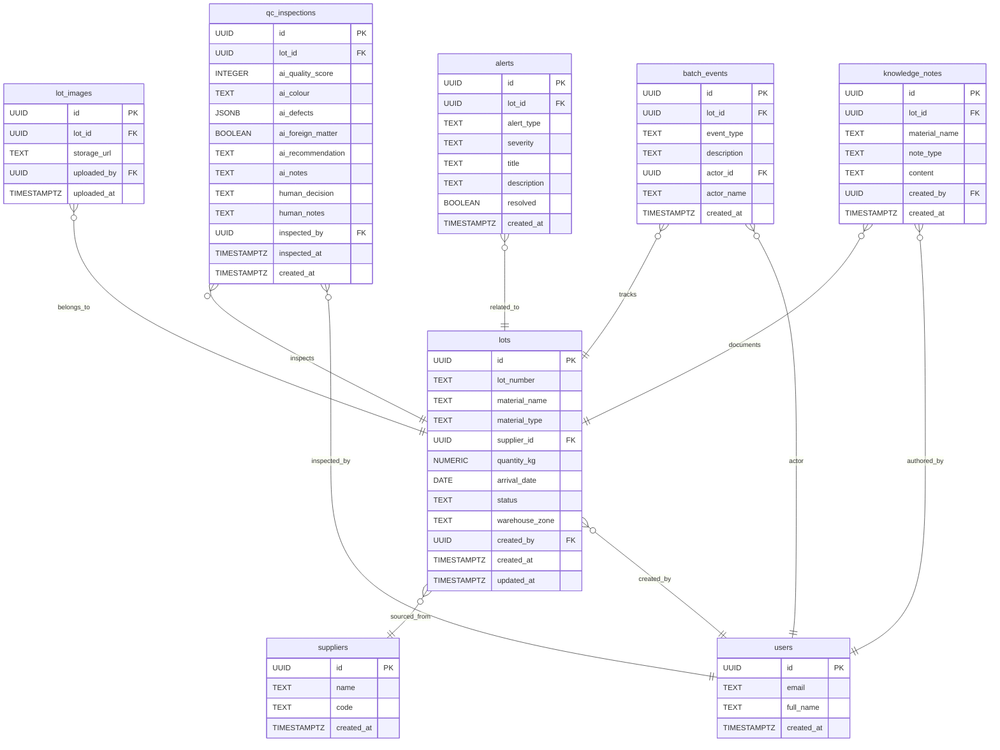

# SimaOS — Digital Batch Intelligence Platform

## Product Requirements Document (v2.1)

---

## The one rule for this build

> Ship a demo that works end-to-end on the core loop — not six half-built features.

**Core loop:** Receive batch → AI grades it → Human approves → Knowledge captured → Passport timeline logged → Sees insights and alerts.

Everything else is cut, deferred, or simplified.

---

# What's IN vs OUT

| Feature                       | Decision   | Reason                                    |
| ----------------------------- | ---------- | ----------------------------------------- |
| Lot creation + passport       | IN         | Heart of the product                      |
| AI QC grading (Claude Vision) | IN         | The wow moment                            |
| Human QC approve/reject       | IN         | Required for audit trail                  |
| Batch event timeline          | IN         | Proves traceability                       |
| User/Manager dashboard        | IN         | Enterprise visibility                     |
| Supplier trend analytics      | IN         | High-value insights from existing QC data |
| Proactive alert engine        | IN         | Demonstrates operational intelligence     |
| Knowledge preservation layer  | IN         | Captures factory expertise                |
| Manufacturing copilot         | IN         | Uses operational and knowledge data       |
| Warehouse zone assignment     | SIMPLIFIED | Dropdown only                             |
| Supplier management           | SEEDED     | Preloaded suppliers                       |
| Production order tracking     | DEFERRED   | Future phase                              |
| Shipment tracking             | DEFERRED   | Future phase                              |
| Interactive warehouse map     | CUT        | Too much effort for MVP                   |
| Cold-chain IoT sensors        | CUT        | Phase 2                                   |
| Multi-facility support        | CUT        | Phase 3                                   |

---

# Database Schema



---

# App Flow

1. Login
2. View lots list
3. Create batch
4. Upload image
5. AI QC grading
6. Approve / reject batch
7. Add knowledge note
8. Assign warehouse zone
9. View Digital Batch Passport
10. Monitor alerts and supplier analytics
11. Ask questions through Copilot

---

# Dashboard Modules

## KPI Cards

- Total lots
- Pending QC
- Approved today
- Rejected today

## Supplier Trend Analytics

Metrics:

- Average quality score
- Approval rate
- Rejection rate
- Total lots received

Views:

- Supplier ranking table
- Best supplier
- Lowest-performing supplier
- Quality trend chart

## Active Alerts

Examples:

- High rejection risk
- Supplier quality declining
- QC delay
- Storage assignment pending

## Manufacturing Copilot

Natural-language questions:

- Which lot is at risk?
- Which supplier performs best?
- Why was LOT-2026-001 approved despite discoloration?
- Which lots are delayed?

---

# API Endpoints

| Method | Path                          | Description       |
| ------ | ----------------------------- | ----------------- |
| POST   | /api/auth/login               | Supabase auth     |
| GET    | /api/lots                     | List lots         |
| POST   | /api/lots                     | Create lot        |
| GET    | /api/lots/:id                 | Lot detail        |
| POST   | /api/lots/:id/images          | Upload image      |
| POST   | /api/qc/grade                 | AI grading        |
| POST   | /api/qc/:lot_id/decision      | Human decision    |
| PATCH  | /api/lots/:id/zone            | Assign zone       |
| GET    | /api/dashboard                | Dashboard summary |
| POST   | /api/copilot                  | AI copilot        |
| GET    | /api/suppliers/analytics      | Supplier metrics  |
| GET    | /api/alerts                   | Active alerts     |
| POST   | /api/knowledge-notes          | Create note       |
| GET    | /api/lots/:id/knowledge-notes | Get lot notes     |

---

# AI Layer

## QC Grading

Claude Vision analyzes material photos and returns:

- Quality score
- Color assessment
- Defects
- Foreign matter
- Recommendation
- Notes

## Manufacturing Copilot

Context:

- Lots
- QC inspections
- Supplier metrics
- Knowledge notes
- Active alerts

Purpose:

- Explain delays
- Surface risks
- Reference historical expertise
- Summarize supplier performance

---

# Operational Intelligence Layer

## Rule-Based Alert Engine

Rules:

```python
if ai_quality_score < 70:
    create_alert("high_rejection_risk")

if supplier_rejection_rate > 30:
    create_alert("supplier_quality_declining")

if lot.status == "in_qc" and age_hours > 48:
    create_alert("qc_delay")

if lot.status == "approved" and warehouse_zone is None:
    create_alert("storage_assignment_pending")
```

Generated alerts automatically appear on the dashboard.

---

# Knowledge Preservation Layer

Purpose:

Capture factory knowledge that normally exists only in employee experience.

Examples:

- Supplier-specific observations
- Material handling recommendations
- Historical QC insights
- Common defects and causes

Example note:

> Turmeric from PT Herbal Nusantara often appears darker than standard but historically achieves acceptable extraction yields and maintains a high approval rate.

Copilot can reference these notes when answering operational questions.

---

# Seed Data

## Lots

| Lot          | Material      | Status        |
| ------------ | ------------- | ------------- |
| LOT-2026-001 | Turmeric      | approved      |
| LOT-2026-002 | Ginger Root   | in_qc         |
| LOT-2026-003 | Pandan Leaf   | rejected      |
| LOT-2026-004 | Lemongrass    | in_production |
| LOT-2026-005 | Clove Extract | arriving      |

## Knowledge Notes

LOT-2026-001

- Supplier frequently delivers darker turmeric.
- Historical approval rate remains above 90%.

LOT-2026-003

- Rainy-season deliveries show elevated moisture risk.

## Alerts

- High Rejection Risk
- Supplier Quality Declining
- QC Delay

---

# Demo Script (90 Seconds)

1. Open SimaOS workspace
2. Show existing lots
3. Open LOT-2026-002
4. Upload image
5. AI grades material
6. Approve batch
7. Add knowledge note
8. Assign warehouse zone
9. Open dashboard
10. Show alerts panel
11. Show supplier analytics
12. Ask copilot:

- Which lot is at risk?
- Why was LOT-2026-001 approved despite discoloration?

13. Copilot references operational and knowledge data
14. End demo

---

# Judging Criteria Alignment

| Criterion            | What SimaOS Demonstrates                                                    |
| -------------------- | --------------------------------------------------------------------------- |
| Enterprise Readiness | Digital Batch Passport, audit trail, operational alerts, supplier analytics |
| Problem-Solution Fit | Replaces manual QC workflows                                                |
| Innovation           | AI vision grading + copilot                                                 |
| UX                   | User workflows                                                              |
| Presentation         | Fast live demo with visible outcomes                                        |

---

# Tech Stack

| Layer         | Tool             |
| ------------- | ---------------- |
| Frontend      | React + Tailwind |
| Backend       | FastAPI          |
| Database/Auth | Supabase         |
| Storage       | Supabase Storage |
| AI            | Claude Sonnet    |
| Deployment    | Vercel + Railway |

---

# Future Roadmap

## Phase 2

- Interactive warehouse map
- Warehouse movement tracking
- Shipment logging
- IoT temperature sensors
- Cold-chain monitoring

## Phase 3

- Multi-facility support
- Predictive maintenance
- Advanced analytics
- Historical trend forecasting
- Role-based access control (RBAC)
- Department-specific workspaces
- Operator, QC, and manager permissions

## Phase 4

- Digital twin
- Cross-factory optimization
- Autonomous recommendations
- Demand forecasting

---

_SimaOS v2.1 — Cyberhack 2026 Edition_
